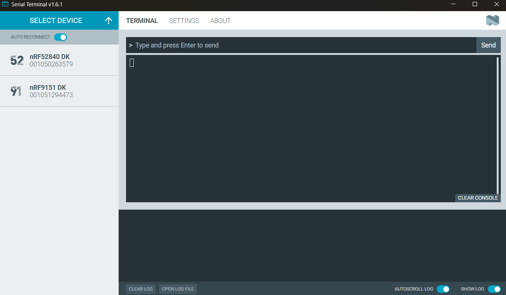
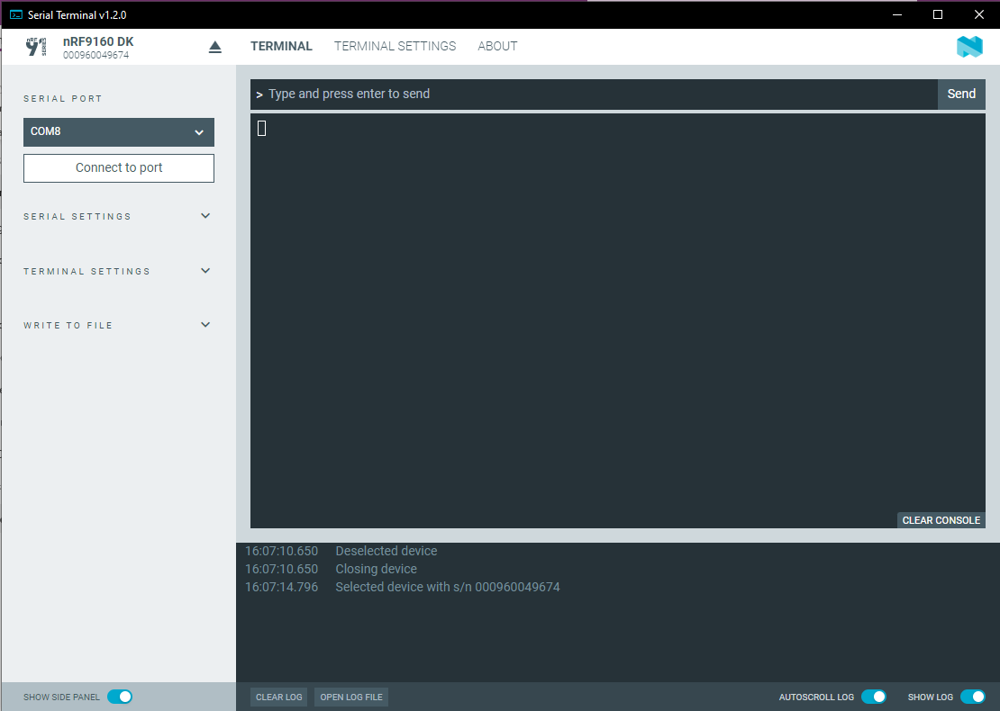

# Getting started

To start using Serial Terminal:

1. Connect the device to your computer using a USB cable.

1. Click **Select Device**. 
   The name and serial number of Nordic Semiconductor devices attached to your computer are displayed.

    

    !!! note "Note"
         Depending on the application firmware on the device, you might see J-Link in place of the product name.

1. Optionally, toggle **Auto-reconnect** on or off depending if you want Serial Terminal to automatically select the last connected serial port and attempt to connect to that port again in the future.

1. Click the device entry to select the device. 
   Serial Terminal selects the serial port with the lowest virtual serial port index (if the device has more than one port). See [Selecting a serial port](selecting_serial_port.md) for more information about the serial port naming conventions.

1. Click **Connect to port** to connect to the selected serial port.

    !!! note "Note"
         If you toggled **Auto-reconnect** on, this step is not required, as the application connects automatically to the last connected serial port or the the serial port with the lowest virtual serial port index.

    Depending on the application firmware running on the device, you might see logging output. You can view information on the device's connection status and settings in the [**Log**](overview.md#log).

     

1. Optionally, expand [**Terminal Mode** side panel section](overview.md#terminal-mode) to select **Shell** or **Line**, depending on the device's capabilities and the mode you want to work in.
1. Send a command to the device by typing or pasting it at the top of the terminal window and pressing Enter or clicking **Send** when in the Line mode.
