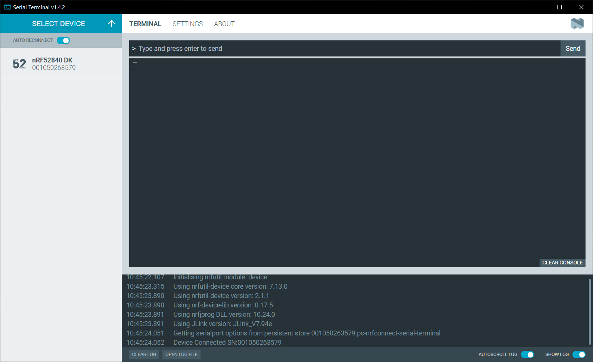
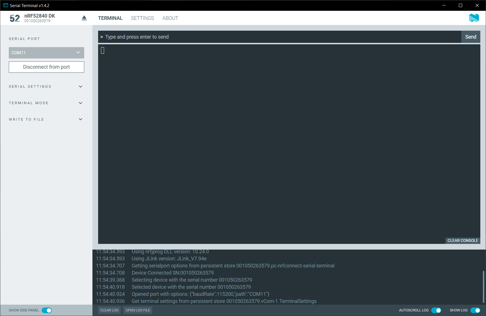

# Getting started

To start using Serial Terminal:

1. Connect the device to your computer using a USB cable.

1. Click **Select Device**. 
   The name and serial number of Nordic Semiconductor devices attached to your computer are displayed.

    

    !!! note "Note"
         Depending on the application firmware on the device, you might see J-Link in place of the product name.

1. Optionally, toggle **Auto-reconnect** on or off depending if you want Serial Terminal to automatically select the last connected serial port and attempt to connect to that port again in the future.

1. Click the device you want to use. 
   If the device has more than one port, Serial Terminal selects the serial port with the lowest virtual serial port index. See [Selecting a serial port](selecting_serial_port.md) for more information. You are free to select another serial port.

    

1. Click **Connect to port** to connect to the selected serial port and, optionally, reset the device. 
   Depending on the application firmware running on the device, you might see logging output. You can view information on the device's connection status and settings in the Serial Terminal **Log** view.

1. Optionally, expand **Terminal Mode** side panel section to select **Shell** or **Line**, depending on the device's capabilities and the mode you want to work in. 
   See [Serial Terminal configuration](./configuration.md) for more information.

1. Send a command to the device by typing or pasting it at the top of the terminal window and pressing Enter or clicking **Send** when in the Line mode.