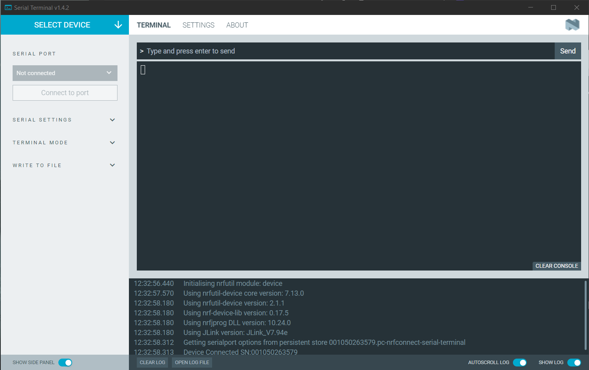
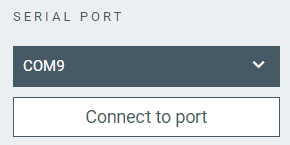
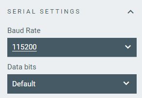
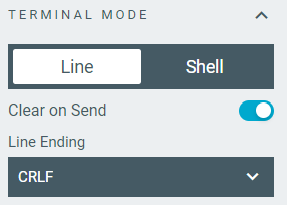
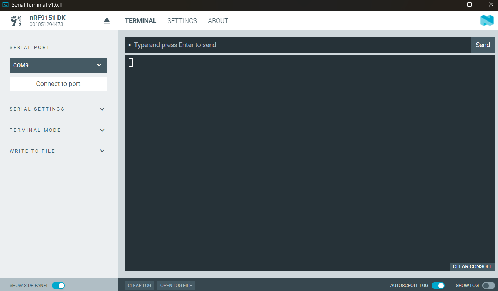
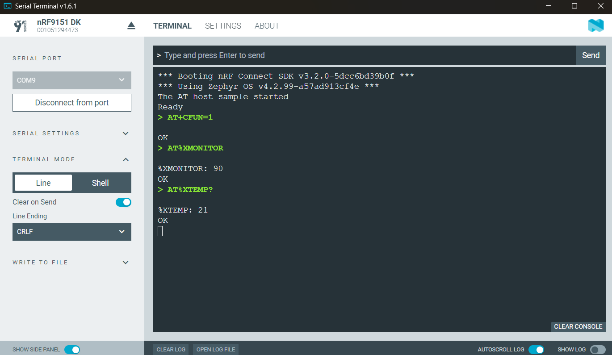
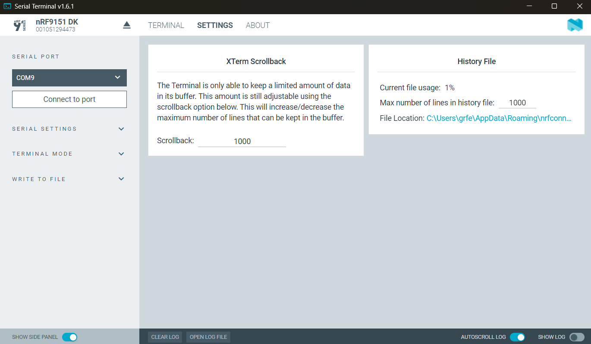

# Overview and user interface

When you start the {{app_name}}, the application main window appears with no device selected and the console empty.
In the background, the application initializes the required nRF Util module and detects the devices connected to the computer, as you can see in the log:

## Select Device

Once you connect a device to the system, it becomes visible and available when you click on the **Select device** drop-down list. Choose a device from the list of connected devices to [connect to it](connecting.md).

## Serial port

In this section, you can select the serial port of the connected device and connect to it.

After you **Connect to port**, the button changes to **Disconnect from port**.

## Settings section

Use the default settings unless the onboard application firmware uses other settings. See [DevAcademy Serial communication (UART)](https://academy.nordicsemi.com/topic/uart-driver/) for more information.

### Serial settings

These settings let you configure the serial connection parameters.

!!! note "Note"
      You can only modify these settings before connecting to the serial port.
      If the fields are greyed out, [**Disconnect from port**](#serial-port) first.

| Setting         | Description                                                                                                              | Available Options      |
|-----------------|--------------------------------------------------------------------------------------------------------------------------|-------------------------|
| **Baud rate**   | The speed at which data is transmitted between devices. Higher baud rates allow for faster data transfer but might be more prone to errors due to signal distortion. For information on supported baud rates, check the device's hardware user guide. The most commonly used baud rates are 115 200, 38 400, 19 200, and 9 600. | `50` to `1 000 000`           |
| **Data bits**   | The number of bits that carry data.                                                                                      | `8` (default), `7`          |
| **Stop bits**   | The number of stop bits.                                                                                                | `1` (default), `2`          |
| **Parity**      | An error-checking mechanism to detect errors in the data transmission. For example, even parity means that the number of 1s in the data byte and parity bit combined is even, while odd parity means that the number of 1s is odd. | `none` (default), `even`, `odd`, `mark` (Windows only), `space` (Windows only) |
| **rts/cts**     | Request to Send (RTS) and Clear to Send (CTS) use two cross-coupled wires between the devices. If hardware flow control is enabled, each end will use its RTS to indicate that it is ready to send new data and read its CTS to see if it is allowed to send data to the other end. | `off` (default), `on`       |
| **xOn**         | When using software flow control, **xOn** (transmission on) signals that the device is ready to accept data.                | `off` (default), `on`       |
| **xOff**        | When using software flow control, **xOff** (transmission off) signals that the device is unable to accept more data.         | `off` (default), `on`       |
| **xAny**        | Software flow control setting.                                                                                          | `off` (default), `on`       |

### Terminal mode

Serial Terminal can work in either line or shell mode.

#### Line mode

Line mode sends each command to the connected device separately. The device processes each command and returns a response before waiting for the next command. This mode is commonly used for devices that are not running a shell, where each command is a discrete operation that the device can perform independently. For example, you can use it to [enter modem AT commands](./viewing_and_sending_at_commands.md).

| Terminal mode  | Setting            | Description                                                                      |
| -------------- | ------------------ | -------------------------------------------------------------------------------- |
| Line           | **Clear on Send**      | When **Clear on Send** is enabled, input text is cleared from the terminal input window after it has been transmitted. |
| Line           | **Line Ending**        | Use this to send an optional line ending to the command sent to the connected device. The alternatives are:  - `None` - `LF` sends the newline character.  - ``CR`` for carriage return.  - ``CRLF`` sends carriage return and newline.     |

#### Shell mode

Use Shell mode when the device you communicate with is running a shell, such as Zephyr™ shell. In this mode, the terminal sends the command or command series to the device for execution by the shell. The shell can return output or prompt the user for additional input. Shell mode allows you to execute more complex operations, navigate the file system, or perform other advanced tasks that are not possible in Line mode.

| Terminal mode | Setting            | Description                                                                      |
| ------------- | ------------------ | -------------------------------------------------------------------------------- |
| Shell         | **Device controls echo** | Toggle this on if echo is enabled on the device. Toggle off if it is not, in which case Serial Terminal echoes the command. In Zephyr shell, run `shell echo on` to turn echo on, and `shell echo off` to disable echo. |

### Write to file

Use the **Save to file** button to save the terminal session to a file.

Until saved, the console output is saved in a buffer, and is limited by the **XTerm Scrollback** setting, found in the **Settings** tab.

## Terminal tab

This is where you can type a command or paste it in and send it to the device.

!!! info "Tip"
      You can select the terminal output and use the middle mouse button to copy and paste it.

Commands sent to the device are displayed with a green ">" prefix. Responses from the device are displayed in white. The terminal supports ANSI escape codes, which allows for color-coded output if your device firmware uses them.

### Terminal tab in Line mode

The following actions are available when in [Line mode](#terminal-mode).

| Action                              | Description                                                                    |
|-------------------------------------|--------------------------------------------------------------------------------|
| **Send**                            | Sends the current command to the device.                                       |
| **CLEAR CONSOLE**                   | Clears the terminal view.                                                      |
| **Arrow Up/Down**                   | Navigate through previously sent commands in the input field.                  |

When using the terminal tab in the Line mode, the line ending is automatically appended to the command based on the [**Line Ending** selection](#line-mode).

## Settings tab

In this tab, you can configure the size of the following settings:

* **XTerm Scrollback** buffer for storing the console output. The buffer value persists between app sessions.
* **History File** for storing the command history between app sessions.

## About tab

You can view application information, restore defaults, access source code and documentation. You also can find information on the selected device, access support tools, send feedback, and enable verbose logging.

## Log

The Log panel allows you to view the most important log events, tagged with a timestamp. Each time you open the app, a new session log file is created. You can find the Log panel and its controls, below the main application Window.

- When troubleshooting, to view more detailed information than shown in the Log panel, use **Open log file** to open the current log file in a text editor.
- To clear the information currently displayed in the Log panel, use **Clear Log**. The contents of the log file are not affected.
- To hide or display the Log panel in the user interface, use **Show Log**.
- To freeze Log panel scrolling, use **Autoscroll Log**.