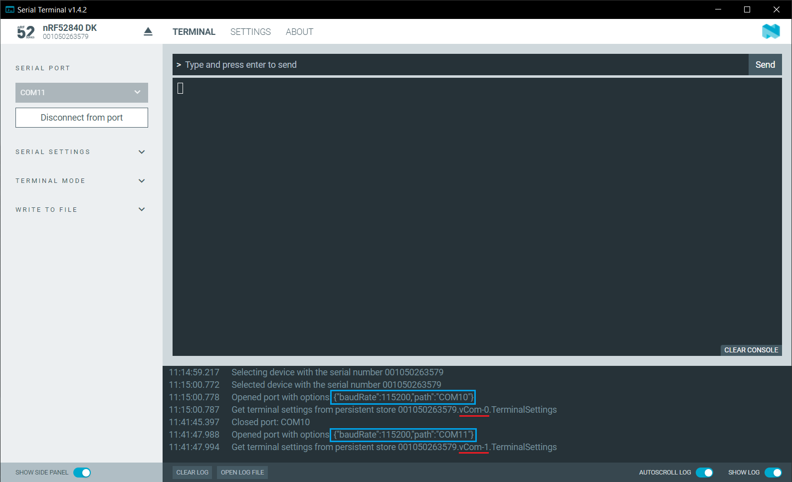

# Selecting a serial port

The number of serial ports available in Serial Terminal depends on the selected device and the onboard application firmware.
You can see the available serial ports when you [connect to the device](connecting.md).

## Identifying serial ports

See your product's hardware user guide for more information on the device's virtual serial ports and Universal Asynchronous Receiver/Transmitter (UART) interface settings. The virtual serial ports on a Nordic Semiconductor Development Kit (DK) are indexed from zero. Your computer's operating system maps each of the device's virtual serial ports to a unique, persistent serial port identifier for the device and computer. Serial Terminal lists the selected device's serial ports in ascending order of its virtual serial port index.

In the following example, the virtual serial ports indexed 0 and 1 on the nRF52840 DK are mapped to serial ports 10 and 11 respectively on the computer. In the log window of the image, you can see that the serial port `"COM10"` is associated with `vCOM-0` (index 0) on the DK, and `"COM11"` is associated with `vCOM-1`.



### Finding the correct port for the OS

Serial ports are also referred to as **COM** ports on Windows, **ttyACM** devices on Linux, and **/dev/tty** devices on macOS.

Depending on what devices you have connected to your computer, you might have several choices.
Your DK can show up as two consecutive COM ports. If this is the case, you need to test which COM port is the correct one.

#### Windows

Complete the following steps to find the correct port:

1. Right-click on the Windows Start menu, and select **Device Manager**.
1. In the **Device Manager** window, scroll down and expand **Ports (COM & LPT)**.
1. Find the port named *JLink CDC UART Port* and note down the number in parentheses.

If you have more than one J-Link UART Port, unplug the one that you want to use, plug it back in, and observe which one appeared last.

#### Linux

Complete the following steps to find the correct port:

1. Open a terminal.
1. Run the following command to list all available serial ports:
   ```bash
   ls /dev/ttyACM*
   ```
1. To see real-time device connections and disconnections, run the following command:
   ```bash
   dmesg -w
   ```
1. Plug in your device and observe which **ttyACM** device appears.

#### macOS

Complete the following steps to find the correct port:

1. Open Terminal.
1. Run the following command to list all available serial ports:
   ```bash
   ls /dev/tty*
   ```
1. Run the following command to list device information, including serial numbers:
   ```bash
   ioreg -p IOUSB -l -w 0
   ```
1. Run the following command to monitor device connections in real time:
   ```bash
   log stream --predicate 'subsystem == "com.apple.iokit.IOUSBHostFamily"'
   ```
1. Plug in your device and observe which **/dev/tty** device appears.
