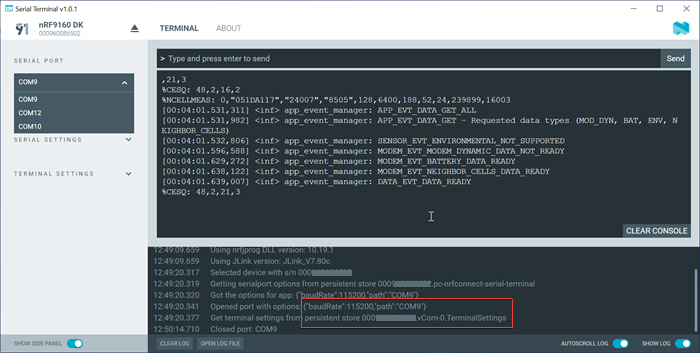

# Selecting a serial port

The number of serial ports available in Serial Terminal depends on the selected device and the onboard application firmware.

## Identifying serial ports

See your product's hardware user guide for more information on the device's virtual serial ports and Universal Asynchronous Receiver/Transmitter (UART) interface settings. The virtual serial ports on a Nordic Semiconductor Development Kit (DK) are indexed from zero. Your computer's operating system maps each of the device's virtual serial ports to a unique, persistent serial port identifier for the device and computer. Serial Terminal lists the selected device's serial ports in ascending order of its virtual serial port index.

In the following example, the virtual serial ports indexed 0, 1, and 2 on the nRF9160 DK are mapped to serial ports 9, 12, and 10 respectively on the computer. In the log window of the image, you can see that SERIAL PORT "COM9" is associated with vCOM-0 (index 0) on the DK.

!!! note "Note"
      Serial ports are also referred to as **COM** ports on Windows, **ttyACM** devices on Linux, and **/dev/tty** devices on macOS.

